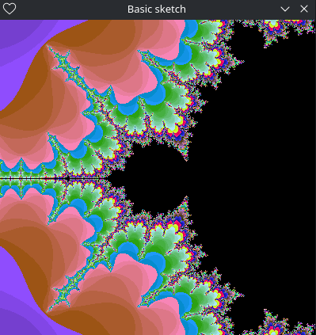

# Elfive

This repo is a collection of my experiments with L5 like adding a test runner, writing some sketches of my own, even adding a basic sound module.
They are all under their appropriately named branches.

### Usage

```bash
    ./run.sh <foldername>
    
    # Example
    ./run.sh mandelbrot
```

The folder must contain a main.lua file which will be copied out to the root and any changes made inside the folder will be synced to the root main.lua which is run with `love .`.

### Examples

